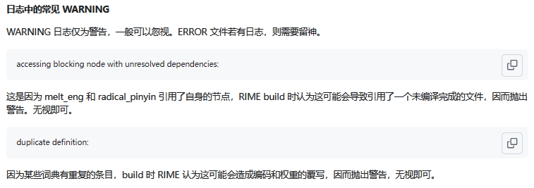

# own_rime_config

# 列表-配置文件说明

|**🌟 文件名**|**🧠 释义**|**🔧 备注**|
|:-:|-|-|
|default.custom.yaml|目前仅记录激活了什么输入法|...|
|default.yaml|主要配置|覆盖写在.custom内|
|double_pinyin_flypy.custom.yaml|小鹤覆盖配置|激活语言模型wanxiang|
|double_pinyin_flypy.schema.yaml|小鹤双拼定制版主文件|...|
|melt_eng.schema.yaml|方便中英文混输方案调用|name:Easy English Nano|
|melt_eng.dict.yaml|name:melt_eng|melt_eng.schema的词库文件|
|radical_pinyin_flypy.schema.yaml|偏旁部件拆字(小鹤)|提供偶尔Uu进行拆字,不需要激活此输入法|
|radical_pinyin.dict.yaml|radical_pinyin|小鹤、全拼等输入法依赖的拆字字库|
|rime_mint。dict.yaml|rime_mint|小鹤依赖的主词重字库|
|squirrel.yaml|皮肤设置的默认兜底文件|🈶️其余样式不生效|
|symbols.yaml|快捷键|定义/bq等快捷输入表情|
|terra_pinyin_all.dict.yaml|name:terra_pinyin_all|地球拼音专用词库|
|terra_pinyin_all.schema.yaml|地球拼音输入法配置|...|
|terra_symbols_all.yaml|地球拼音专用快捷键|...|
|wanxiang-lts-zh-hans.gram|万象语法模型|RIME-LMDG|
|weasel.yaml|主要样式配置|添加自定义皮肤及预览图片(/preview)|
|-|-|-|
|opencc/fly_Chaifen.json|乙	〔フフ｜yivv〕|显示拆字结果|
|ibus_rime.yaml|已删除|Linux 平台用，不适用于 Windows（Weasel）|
|.cnb.yml|上传release|已删除|

配置文件中大部分都有注释，配合教程：[配置覆写](https://www.mintimate.cc/zh/guide/configurationOverride.html)

---

# 1. 待解决:

1. 拆字同时显示中文和双拼拼音

2. is_in_user_lua文件无法和拆字共存

~~3. 有点卡顿,考虑禁用腾讯字库~~

~~4. 候选项的emoji有点太多了,需要降低权重~~

~~5. 地球拼音重复问题,需删除Rime\weasel-0.17.4\data下的terra同名文件,或者改名~~

6. 字库重复太多,删除data下bin文件重新部署报错

# 2. 已修改:
1. rime_mint.dict修改字库,~~雾凇+白霜~~万象

2. 删除不需要的输入法,只留小鹤双拼和地球拼音-薄荷

3. preview增加自定义配色皮肤+预览图

4. 修改rime_mint的依赖词库,目前采用白霜

5. 合并terra_pinyin和rime_mint为一个输入法(terra为主)

6. 修改terra_pinyin_all,防止名称重复不显示

7. 增加is_in_user_dict.lua,用于显示待选项来源

8. 增加小键盘的数字丶符号可被计算器调用

# 3. 已知问题


```
optional resource not loaded: terra_pinyin_all.custom

optional resource not loaded: symbols.custom
```
提示找不到你未定义的可选 patch 文件

不影响输入法功能，可以忽略，或者添加空的 *.custom.yaml 文件来去除提示

例如：patch: {}

---

# 自用整合配置 

## ```安装到C盘内需将程序目录内的[WeaselServer.exe]兼容性设置为管理员```

本输入方案内主要使用：

- 小鹤双拼-薄荷定制: 基于小鹤双拼，添加定制内容。支持输入音形(形码)、自然码辅助码或墨奇辅助码作为辅助输入；

- 地球拼音-薄荷定制: 全拼，备用。

## Tips

本地rime配置文件默认地址，如下

- Windows
  - Weasel: `%APPDATA%\Rime`
- Linux
  - iBus:`~/.config/ibus/rime`
  - Fcitx5: `~/.local/share/fcitx5/rime`

- Fctix5 Android(小企鹅入法): `/storage/emulated/0/Android/data/org.fcitx.fcitx5.android/files/data/rime/`

本地rime日志文件默认地址如下：

- Windows
  - Weasel: `%TEMP%`

- Linux
  - iBus:`/tmp`

---

## 词库定制以及更新

```txt
dicts
├── cn_dicts                         # 中文词库目录
│   ├── 8105.dict.yaml              # 8105 常用汉字词库
│   ├── 41448.dict.yaml             # 扩展汉字词库
│   ├── base.dict.yaml              # 基础词库
│   ├── ext.dict.yaml               # 扩展词库（可能包含用户常用词）
│   ├── others.dict.yaml            # 其他中文词条集合
│   └── tencent.dict.yaml           # 腾讯高频词库（建议保留，用于优化联想）
│
├── dicts_LMDG                      # 中文词库目录(万象)
│   ├── corrections.dict.yaml       # 错字纠音最优先
│   ├── chars.dict.yaml             # 单字基础保障
│   ├── base.dict.yaml              # 常用词，主干
│   ├── compatible.dict.yaml        # 多音优化
│   ├── correlation.dict.yaml       # 四字成词
│   ├── suggestion.dict.yaml        # 五字以上联想
│   ├── people.dict.yaml            # 人名
│   ├── place.dict.yaml             # 地名
│   └── poetry.dict.yaml            # 诗词/成语/典故类，靠后
│
├── 当输入四字以上内容时，更容易联想到诗词成语（如五言七言、惯用语），提升输入体验。可将 poetry 放在 suggestion 之前
│
│
├── cn_dicts_cell                   # 中文 cell 词库（通常为 Rime Cell 格式词条）
│   └── ...                         # 若有多个细分类词库可放此处
│
├── en_dicts                        # 英文词库目录
│   ├── cn_en_flypy.txt             # 中英混输（flypy风格）映射表
│   ├── cn_en.txt                   # 中英混输映射表（全拼风格）
│   ├── en_ext.dict.yaml            # 英文扩展词库（可包含技术词、专业术语等）
│   └── en.dict.yaml                # 基础英文词库
│
├── custom_simple.dict.yaml     # 自定义英文词库（你可自己维护添加）
└── other_kaomoji.dict.yaml     # 英文颜文字表情词库（Kaomoji）

```

后续更新词库；可以下载万象仓库`dicts`内的文件，除了`custom_simple.dict.yaml`的文件，其他都进行覆盖替换即可。

如果想自己扩展词库，可以在输入法的字典配置文件内进行导入，比如字典配置文件[rime_mint.dict.yaml](rime_mint.dict.yaml)内：

```yaml
name: rime_mint                  # 注意name和文件名一致
version: "2025.07.31"
sort: by_weight
use_preset_vocabulary: false
# 此处为 输入法所用到的词库，既补充拓展词库的地方
# 雾凇拼音词库，由Github Robot自动更新
import_tables:
  - dicts/custom_simple          # 自定义
  # - dicts/cn_dicts/8105           # 字表
  # - dicts/cn_dicts/41448         # 大字表（按需启用）
  # - dicts/cn_dicts/base         # 基础词库
  # - dicts/cn_dicts/ext          # 扩展词库
  # - dicts/cn_dicts/tencent  # 腾讯词向量（大词库，部署时间较长）
  # - dicts/other_kaomoji          # 颜文字表情（按`VV`呼出)
  # - dicts/cn_dicts/others        # 雾凇拼音 others词库（用于自动纠错）

  - dicts/dicts_LMDG/corrections         # 错字纠音最优先
  - dicts/dicts_LMDG/chars               # 单字基础保障
  - dicts/dicts_LMDG/base                # 常用词，主干
  - dicts/dicts_LMDG/compatible          # 多音优化
  - dicts/dicts_LMDG/correlation         # 四字成词
  - dicts/dicts_LMDG/suggestion          # 五字以上联想
  - dicts/dicts_LMDG/people              # 人名
  - dicts/dicts_LMDG/place               # 地名
  - dicts/dicts_LMDG/poetry              # 诗词/成语/典故类，靠后

  # 细胞词库
  - dicts/cn_dicts_cell/medication
  - dicts/cn_dicts_cell/industry_product
  - dicts/cn_dicts_cell/exthot
  - dicts/cn_dicts_cell/chess
  - dicts/cn_dicts_cell/chess2
  - dicts/cn_dicts_cell/animal
  - dicts/cn_dicts_cell/game
  - dicts/cn_dicts_cell/idiom
  - dicts/cn_dicts_cell/sport
  - dicts/cn_dicts_cell/media
  - dicts/cn_dicts_cell/shulihua
  - dicts/cn_dicts_cell/food
  - dicts/cn_dicts_cell/inputmethod
  - dicts/cn_dicts_cell/history
  - dicts/cn_dicts_cell/place
  - dicts/cn_dicts_cell/geography
  - dicts/cn_dicts_cell/name2
  - dicts/cn_dicts_cell/literature
  - dicts/cn_dicts_cell/music
  - dicts/cn_dicts_cell/computer
  - dicts/cn_dicts_cell/composite
  - dicts/cn_dicts_cell/name
```
---